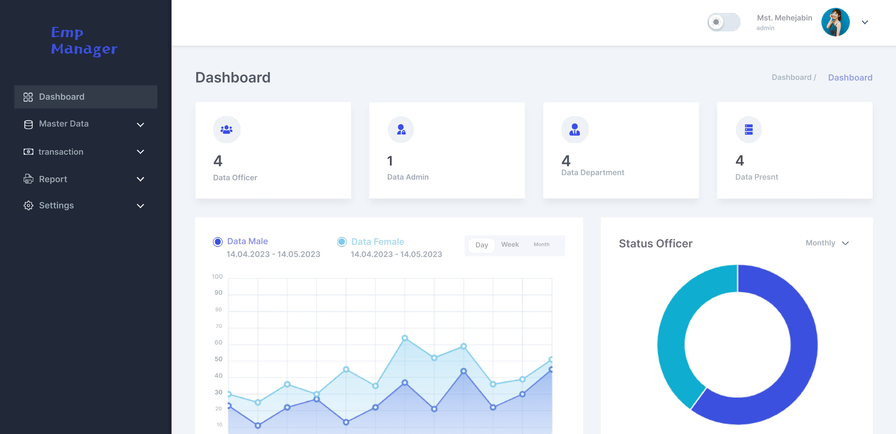
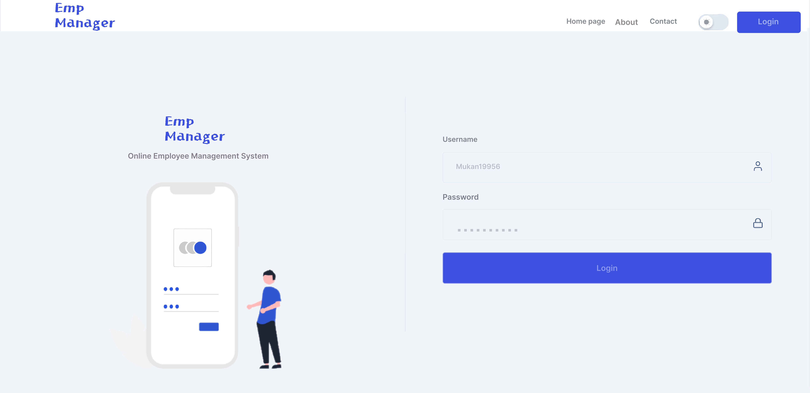

# Employee Management System

This project is an Employee Management System that allows admins and staff to manage employee information, attendance, and payroll efficiently. The system provides a range of features including adding and editing employees, managing positions, tracking absences, processing salaries, and printing reports. It supports admin and employee roles with separate dashboards and functionalities.

## Key Features

- Admin login
- Add, edit, and remove employees
- Manage positions (add, edit, remove)
- Track attendance (view, input, edit, delete absences)
- Salary deduction settings
- Manage salary data (view, input, edit, delete)
- Print payroll reports, absences, and payslips
- Admin and employee password management
- Employee login to view personal salary reports
- Responsive design
- 404 Page and more

## Screenshots

### 1. Admin Dashboard


### 2. Admin Login


## Technologies Used

### Frontend
- **React JS**: JavaScript library for building user interfaces
- **React Hooks**: Manage and centralize application state
- **React Router Dom**: Handle routing
- **Axios**: Making API calls
- **Tailwind CSS**: Styling for the user interface
- **React Icons**: Add icons to the app
- **Redux**: Manage complex state
- **Localforage**: Save data asynchronously in the browser
- **React Vite**: Improve website speed
- **Redux Toolkit**: Simplify Redux usage
- **Apexcharts**: Create interactive graphics
- **Match Sorter**: Enhance interactive graphics
- **Email JS**: Handle email interactions
- **Framer Motion**: Create smooth animations
- **React Redux**: State management
- **React to Print**: Print PDFs
- **Sweet Alert2**: Create various pop-up alerts

### Backend
- **Node JS**: JavaScript runtime for fast server-side applications
- **Express JS**: Server framework for handling HTTP requests
- **MySQL12**: Database for storing authentication data
- **Cors**: Handle Cross-Origin Resource Sharing
- **Bcrypt JS**: Data encryption
- **Dotenv**: Load environment variables
- **Nodemon**: Monitor changes to the code during development
- **Jsonwebtoken**: Token-based authentication
- **Cookie Parser**: Parse cookies for authentication
- **Sequelize**: ORM for managing MySQL database
- **Argon2**: Secure password hashing function
- **Connect Session Sequelize**: Implement session-based authentication

### Database
- **MySQL**: Used to store application data, including employee information and payroll data.

## Installation

1. Clone the repository:
   ```bash
   git clone https://github.com/maruf119459/Employee-Management-System.git